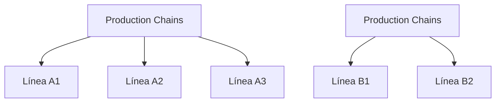

Production lines and chains define the organizational structure of manufacturing operations in APTIV Scrap Control. This hierarchy enables granular scrap tracking and reporting.

## Production Hierarchy

The system uses a two-level production hierarchy:



<Steps>
  <Step title="Cadenas (Production Chains)">
    Top-level grouping representing major production areas or product families
  </Step>
  <Step title="Líneas (Production Lines)">
    Individual production lines within each chain, can be fixed or flexible
  </Step>
</Steps>

---

## Production Chains (Cadenas)

Chains group multiple production lines by product type or manufacturing process.

### TypeScript Interface

```typescript types.ts
export interface Cadena {
  id: number;
  nombre: string;            // Chain name
  descripcion: string;       // Description
  activo: number;            // 1=active, 0=inactive
}
```

### Database Schema

```sql schema.sql
CREATE TABLE IF NOT EXISTS cadenas (
  id int AUTO_INCREMENT PRIMARY KEY,
  nombre varchar(50) NOT NULL,
  descripcion varchar(200) DEFAULT '',
  activo TINYINT DEFAULT 1
);
```

### Sample Chains

<CardGroup cols={2}>
  <Card title="Cadena 1" icon="1">
    **Producción arneses motor**
    
    Manufactures wire harnesses for automotive engines
    - 3 fixed lines (A1, A2)
    - 1 flexible line (A3)
  </Card>
  <Card title="Cadena 2" icon="2">
    **Conectores y terminales**
    
    Produces electrical connectors and terminals
    - 2 fixed lines (B1, B2)
  </Card>
  <Card title="Cadena 3" icon="3">
    **Ensambles especiales**
    
    Specialized assemblies and custom components
    - 1 flexible line (C1)
    - 1 fixed line (C2)
  </Card>
  <Card title="Cadena 4" icon="4">
    **Soldadura y acabado**
    
    Welding and finishing operations
    - 1 fixed line (D1)
  </Card>
</CardGroup>

### Example Data

```typescript seed.ts
export const seedCadenas: Cadena[] = [
  { id: 1, nombre: 'Cadena 1', descripcion: 'Producción arneses motor', activo: 1 },
  { id: 2, nombre: 'Cadena 2', descripcion: 'Conectores y terminales', activo: 1 },
  { id: 3, nombre: 'Cadena 3', descripcion: 'Ensambles especiales', activo: 1 },
  { id: 4, nombre: 'Cadena 4', descripcion: 'Soldadura y acabado', activo: 1 },
];
```

---

## Production Lines (Líneas)

Lines are the actual manufacturing workstations within each chain.

### TypeScript Interface

```typescript types.ts
export interface Linea {
  id: number;
  cadena_id: number;         // Foreign key to cadenas table
  nombre: string;            // Line name (Línea A1, Línea B2)
  tipo: string;              // Type: 'Fija' or 'Flexible'
  supervisor_id?: number;    // Optional: assigned supervisor
  activo: number;            // 1=active, 0=inactive
}
```

### Database Schema

```sql schema.sql
CREATE TABLE IF NOT EXISTS lineas (
  id int AUTO_INCREMENT PRIMARY KEY,
  cadena_id int NOT NULL,
  nombre varchar(50) NOT NULL,
  tipo varchar(50) DEFAULT 'Fija',
  supervisor_id int DEFAULT NULL,
  activo TINYINT DEFAULT 1,
  FOREIGN KEY (cadena_id) REFERENCES cadenas(id) ON DELETE CASCADE
);
```

<Note>
The `cadena_id` foreign key ensures referential integrity. Deleting a chain will cascade delete all its associated lines.
</Note>

### Line Types

<Accordion title="Fija (Fixed Line)">
  **Fixed production lines** manufacture a specific product or product family:
  
  - Dedicated equipment and tooling
  - Consistent process flow
  - Standard staffing requirements
  - Most common in high-volume production
  
  **Example:** Línea A1 - Always produces motor wire harnesses
</Accordion>

<Accordion title="Flexible (Flexible Line)">
  **Flexible production lines** can manufacture multiple products:
  
  - Modular equipment configuration
  - Quick changeover capability
  - Variable staffing based on product
  - Used for mixed-model production
  
  **Example:** Línea A3 - Switches between different harness models
</Accordion>

### Sample Lines by Chain

```typescript seed.ts
export const seedLineas: Linea[] = [
  // Cadena 1 - Arneses motor
  { id: 1, cadena_id: 1, nombre: 'Línea A1', tipo: 'Fija', activo: 1 },
  { id: 2, cadena_id: 1, nombre: 'Línea A2', tipo: 'Fija', activo: 1 },
  { id: 3, cadena_id: 1, nombre: 'Línea A3', tipo: 'Flexible', activo: 1 },
  
  // Cadena 2 - Conectores
  { id: 4, cadena_id: 2, nombre: 'Línea B1', tipo: 'Fija', activo: 1 },
  { id: 5, cadena_id: 2, nombre: 'Línea B2', tipo: 'Fija', activo: 1 },
  
  // Cadena 3 - Ensambles especiales
  { id: 6, cadena_id: 3, nombre: 'Línea C1', tipo: 'Flexible', activo: 1 },
  { id: 7, cadena_id: 3, nombre: 'Línea C2', tipo: 'Fija', activo: 1 },
  
  // Cadena 4 - Soldadura
  { id: 8, cadena_id: 4, nombre: 'Línea D1', tipo: 'Fija', activo: 1 },
];
```

---

## Scrap Record Integration

When operators register scrap, they select both chain and line:

### Scrap Record Fields

```typescript types.ts
export interface Pesaje {
  // ... other fields
  CADENA: string;            // Chain name (legacy text field)
  CADENA_ID?: number;        // Chain ID (new FK)
  LINEA?: string;            // Line name (legacy text field)
  LINEA_ID?: number;         // Line ID (new FK)
  // ... other fields
}
```

<Note>
The system maintains both text fields (`CADENA`, `LINEA`) and ID references (`CADENA_ID`, `LINEA_ID`) for backward compatibility with existing data.
</Note>

### Database Schema

```sql schema.sql
CREATE TABLE IF NOT EXISTS pesaje (
  ID int NOT NULL AUTO_INCREMENT,
  AREA varchar(50) DEFAULT NULL,
  NP varchar(50) DEFAULT NULL,
  MATERIAL varchar(50) DEFAULT NULL,
  PESO double(6,4) DEFAULT NULL,
  COSTO double(10,3) DEFAULT NULL,
  CADENA varchar(20) DEFAULT NULL,
  TURNO varchar(20) DEFAULT NULL,
  TIPO varchar(50) DEFAULT NULL,
  SUPERVISOR varchar(50) DEFAULT NULL,
  FECHA_REGISTRO datetime DEFAULT NULL,
  TOTAL_PZAS varchar(50) DEFAULT NULL,
  MODO_FALLA varchar(100) DEFAULT '-',
  USUARIO_ID int DEFAULT NULL,
  COMENTARIOS text DEFAULT NULL,
  FOTO varchar(255) DEFAULT NULL,
  ELIMINADO TINYINT DEFAULT 0,
  CATEGORIA varchar(50) DEFAULT NULL,
  UNIDAD varchar(20) DEFAULT NULL,
  CADENA_ID int DEFAULT NULL,
  LINEA_ID int DEFAULT NULL,
  LINEA varchar(50) DEFAULT NULL,
  UPDATED_AT datetime DEFAULT NULL,
  PRIMARY KEY (ID)
);
```

---

## Managing Production Lines

### Adding a New Chain

<Steps>
  <Step title="Navigate to Catalogs">
    From the main menu, select **Catálogos** → **Cadenas**
  </Step>
  <Step title="Create Chain">
    Click **+ Agregar** and enter:
    - **Nombre**: Chain name (e.g., "Cadena 5")
    - **Descripción**: Purpose or product family
  </Step>
  <Step title="Save">
    Click **Guardar** to create the chain. It will be assigned an auto-incremented ID.
  </Step>
</Steps>

### Adding a New Line

<Note>
**Note:** The Lines catalog is currently hidden in the UI (`Catalogs.tsx:104`) but can be managed via API or database.
</Note>

<Steps>
  <Step title="API Method (Recommended)">
    Use the `/api/catalogs/lineas` endpoint:
    
    ```bash
    POST /api/catalogs/lineas
    {
      "cadena_id": 1,
      "nombre": "Línea A4",
      "tipo": "Fija",
      "activo": 1
    }
    ```
  </Step>
  <Step title="Database Method">
    Insert directly into the `lineas` table:
    
    ```sql
    INSERT INTO lineas (cadena_id, nombre, tipo, activo) 
    VALUES (1, 'Línea A4', 'Fija', 1);
    ```
  </Step>
  <Step title="Enable UI Management (Optional)">
    Remove line 104 filter in `Catalogs.tsx`:
    
    ```typescript
    // Remove this line:
    .filter(t => t.id !== 'lineas')
    ```
  </Step>
</Steps>

---

## Reporting by Chain and Line

The production hierarchy enables powerful reporting capabilities:

### By Chain Report

```typescript
GET /api/reports/by-cadena?start=2024-01-01&end=2024-01-31
```

Returns scrap totals aggregated by production chain:

```json
[
  {
    "cadena": "Cadena 1",
    "total_pzas": 450,
    "total_peso": 56.25,
    "total_costo": 1125.00
  },
  {
    "cadena": "Cadena 2",
    "total_pzas": 320,
    "total_peso": 14.40,
    "total_costo": 576.00
  }
]
```

### Drill-Down Capability

Reports allow drilling down from chain → line → area:

<Steps>
  <Step title="Chain Level">
    View total scrap for each production chain to identify problematic chains
  </Step>
  <Step title="Line Level">
    Filter by specific chain to see which lines within that chain generate the most scrap
  </Step>
  <Step title="Area Level">
    Further filter by line to identify which process areas need attention
  </Step>
</Steps>

---

## Supervisor Assignment

Lines can be assigned to supervisors for accountability:

### Linking Supervisor to Line

```sql
UPDATE lineas 
SET supervisor_id = 3 
WHERE id = 1;
```

### Use Cases

<CardGroup cols={2}>
  <Card title="Scrap Accountability" icon="user-tie">
    Track which supervisor is responsible for scrap generated on each line
  </Card>
  <Card title="Filtered Reports" icon="filter">
    Supervisors can view reports filtered to only their assigned lines
  </Card>
  <Card title="Performance Metrics" icon="chart-line">
    Calculate scrap rates per supervisor for performance reviews
  </Card>
  <Card title="Alert Routing" icon="bell">
    Send scrap alerts to the line supervisor when tolerances are exceeded
  </Card>
</CardGroup>

---

## Best Practices

### Naming Conventions

<Accordion title="Chain Naming">
  Use descriptive names that reflect the product family:
  
  - ✅ "Cadena 1 - Arneses Motor"
  - ✅ "Cadena 2 - Conectores"
  - ❌ "Línea Principal" (too generic)
  - ❌ "Producción A" (unclear)
</Accordion>

<Accordion title="Line Naming">
  Use alphanumeric codes that reference the parent chain:
  
  - ✅ "Línea A1" (A = Cadena 1, 1 = first line)
  - ✅ "Línea B2" (B = Cadena 2, 2 = second line)
  - ❌ "Línea 1" (doesn't indicate chain)
  - ❌ "Producción 001" (unclear hierarchy)
</Accordion>

### Hierarchy Design

<Steps>
  <Step title="Group by Product Family">
    Create chains based on similar products or processes, not physical location
  </Step>
  <Step title="Balance Line Count">
    Aim for 2-5 lines per chain. Too few suggests chains are too granular; too many suggests they're too broad
  </Step>
  <Step title="Consider Flexibility">
    Designate lines as "Flexible" if they produce multiple products to ensure accurate scrap attribution
  </Step>
  <Step title="Plan for Growth">
    Leave numeric gaps in line numbering (A1, A3, A5) to allow for future line additions
  </Step>
</Steps>

---

## Tolerance Configuration

Production chains and lines can have specific scrap tolerance limits:

### Chain-Level Tolerances

```typescript types.ts
export interface Tolerancia {
  id: number;
  nombre: string;
  tipo_objetivo: 'global' | 'cadena' | 'linea' | 'area' | 'categoria';
  objetivo_id: string;       // Chain name or ID
  tipo_periodo: 'diario' | 'semanal' | 'mensual';
  cantidad_max: number;      // Max pieces
  costo_max: number;         // Max cost (USD)
  porcentaje_alerta: number; // Alert threshold (80 = 80%)
  activo: number;
}
```

### Example Configuration

```typescript seed.ts
{
  id: 3,
  nombre: 'Límite semanal Cadena 1',
  tipo_objetivo: 'cadena',
  objetivo_id: 'Cadena 1',
  tipo_periodo: 'semanal',
  cantidad_max: 300,
  costo_max: 3000,
  porcentaje_alerta: 80,
  activo: 1
}
```

When Cadena 1 reaches 240 pieces (80% of 300) in a week, the system triggers an alert.

---

## API Reference

### Chains Endpoints

| Method | Endpoint | Description |
|--------|----------|-------------|
| GET | `/api/catalogs/cadenas` | List all chains |
| POST | `/api/catalogs/cadenas` | Create new chain |
| PUT | `/api/catalogs/cadenas/:id` | Update chain |
| DELETE | `/api/catalogs/cadenas/:id` | Deactivate chain |

### Lines Endpoints

| Method | Endpoint | Description |
|--------|----------|-------------|
| GET | `/api/catalogs/lineas` | List all lines |
| GET | `/api/catalogs/lineas?cadena_id=1` | List lines for specific chain |
| POST | `/api/catalogs/lineas` | Create new line |
| PUT | `/api/catalogs/lineas/:id` | Update line |
| DELETE | `/api/catalogs/lineas/:id` | Deactivate line |

<Note>
All endpoints require authentication and the **manage_catalogs** permission.
</Note>